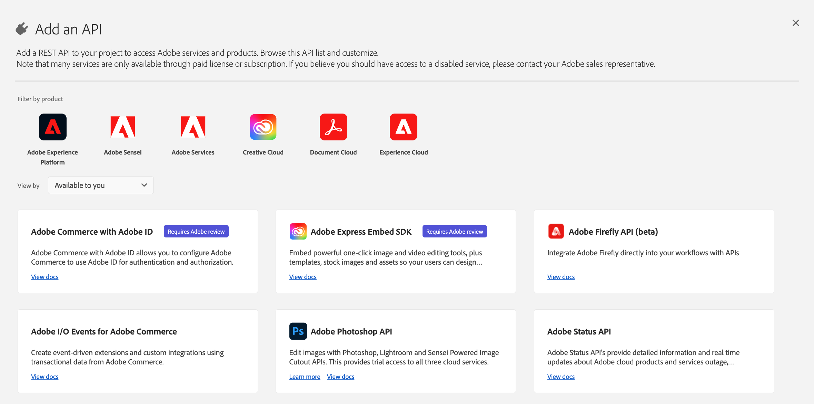
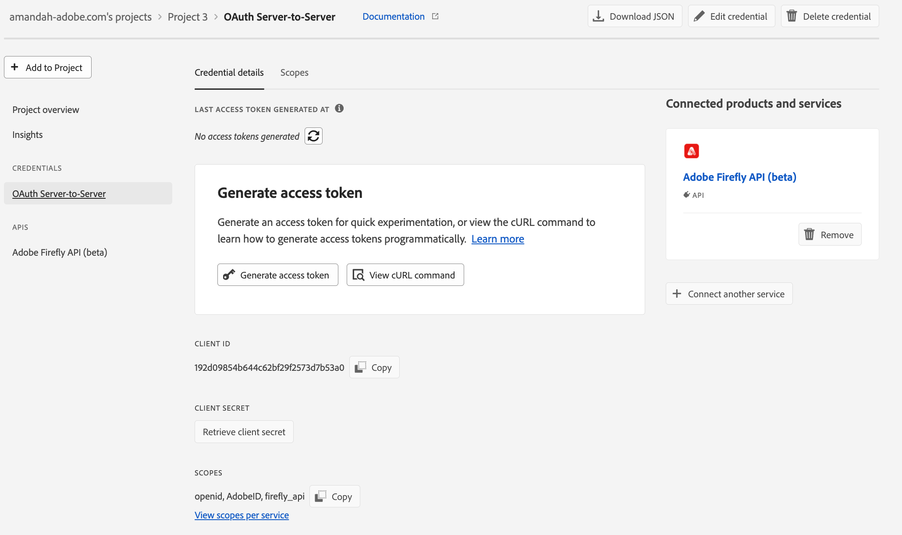

# [Admins only] Get credentials

<InlineAlert variant="warning" slots="text" />

This page is for organization admins who create project credentials for their teams. If you are a developer and your admin has shared a valid client ID and secret with you, start from the [Workflow Builder API overview](../../index.md).

## Access Adobe Developer Console

Navigate to the **API and services** section. Search for **Workflow Builder API**.



If you do not see the Workflow Builder API product card, wait a few minutes and try again. Contact your Adobe representative if the product still does not appear.

## Create a new project

When you can see the Workflow Builder API product card, choose **Create project**.

1. Register a project name so you can find the project later in Developer Console. You can change this name later.
2. In the modal, choose **Save configured API**. On the next screen, you can see your **client ID** (API key).
3. In the left navigation, open **OAuth Server-to-Server** and choose **Retrieve client secret** to get your client secret.



**To call Workflow Builder API, developers need a valid client ID (API key) and an access token.** Because organization admins are often the only people who can access these projects in the Console, relying on the **Generate access token** button on the credential overview page is not ideal for every team.

<InlineAlert variant="warning" slots="text" />

Instead of sharing access tokens, share the **client ID** and **client secret** with developers who need access to the API. They can generate new access tokens programmatically; access tokens expire (for example after 24 hours).

After you configure your project in Developer Console:

- In the **Generate access tokens** block, select **View cURL command**.
- Copy the command and share it with developers in your organization. It should look similar to the following:

```bash
curl -X POST 'https://ims-na1.adobelogin.com/ims/token/v3' \
-H 'Content-Type: application/x-www-form-urlencoded' \
-d 'grant_type=client_credentials&client_id={client_id}&client_secret={client_secret}&scope=openid,AdobeID,session,additional_info,read_organizations,firefly_api,ff_apis'
```

Read more about generating access tokens in the [Authentication](../index.md) guide. There you can also find steps for rotating your client secret programmatically.
